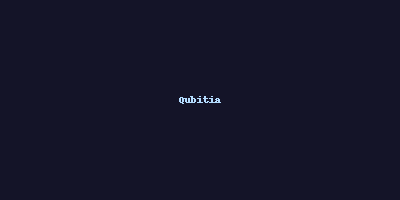

# Qubitia Programming Language

<p align="center">
  
</p>

Qubitia es un **lenguaje de programación experimental** inspirado en la computación cuántica ⚛️  
y diseñado como demostración de cómo crear un lenguaje nuevo y publicarlo en **GitHub**.  

---

## 🚀 Características
- Extensión: `.qbt`
- Palabras clave: `let`, `fn`, `return`, `if`, `else`, `qubit`, `measure`
- Soporte de **Tree-sitter** para resaltado de sintaxis.
- Incluye ejemplos (`examples/hello.qbt`).

### Ejemplo en Qubitia

```qbt
// Simulación simple de un qubit
fn main() {
  qubit q1
  measure q1
  print("Hola desde Qubitia!")
}
```
